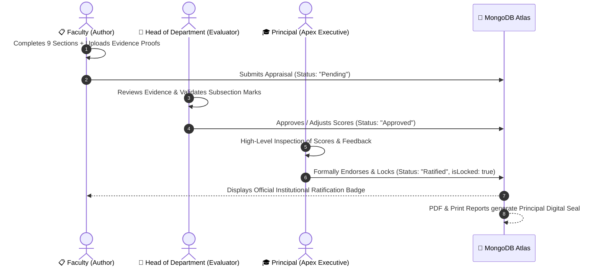

# 🎓 Thiagarajar College of Engineering (TCE)
## Annual Faculty Performance Appraisal & Governance System

[](https://reactjs.org/)
[](https://vitejs.dev/)
[](https://nodejs.org/)
[](https://expressjs.com/)
[](https://www.mongodb.com/atlas)
[](https://tailwindcss.com/)
[](#)

A unified, multi-tier institutional performance appraisal platform engineered for **Thiagarajar College of Engineering (TCE), Madurai** (A Govt. Aided Autonomous Institution Affiliated to Anna University, NAAC A++).

---

## 📌 Table of Contents
- [Architecture & Governance Hierarchy](#-architecture--governance-hierarchy)
- [Key Features & Modules](#-key-features--modules)
- [Appraisal Evaluation Rubric (9 Sections)](#-appraisal-evaluation-rubric-9-sections)
- [Tech Stack](#-tech-stack)
- [Getting Started & Local Setup](#-getting-started--local-setup)
- [Environment Variables](#-environment-variables)
- [Production Deployment Guide](#-production-deployment-guide)
- [Institutional Directory & Role Mapping](#-institutional-directory--role-mapping)

---

## 🏛️ Architecture & Governance Hierarchy

The platform implements strict institutional role separation to satisfy NAAC, NBA, and NIRF accreditation audits:



### Institutional Role Privileges:
1. **Faculty**: Fill out 9-section self-appraisal, auto-save drafts offline, submit to database, view historical status & feedback, download official PDF/Excel reports.
2. **Head of Department (HoD)**: Dual-mode workspace (switch between departmental evaluation inbox and personal self-appraisal), line-by-line mark evaluation, subsection remarks, AI-assisted feedback generation, and approve/return workflows.
3. **Registrar**: Campus-wide oversight across all 16 departments, Department Management & HoD Rotation/Handover portal, new faculty registration, and compliance tracking.
4. **Principal**: College-wide accreditation benchmarks & analytics, read-only inspection of HoD scores, executive commendations, and one-click institutional ratification and permanent audit locking.
5. **Super Admin**: 4-Tier Master Switcher (`Principal`, `Registrar`, `HoD`, `Faculty`) for executive testing and institutional management.

---

## ✨ Key Features & Modules

- **Master Faculty Directory (350+ Members across 16 Departments)**:
  - Dual-email recognition supporting both personal emails (`name@tce.edu`) and department generic emails (`hodcse@tce.edu`).
  - Automatic JSON, CSV, and XLSX directory extraction and synchronization.

- **Dynamic HoD Rotation & Handover Engine**:
  - Secure leadership transitions (`POST /api/directory/change-hod`).
  - Automatic demotion of outgoing HoD to faculty mode (unlocking their self-appraisal workbench) and promotion of incoming HoD with departmental evaluation rights.
  - Immutability guarantee: Historical appraisals submitted under previous HoDs preserve their original signatures and marks.

- **Zero Ghost-Marks Scoring Engine**:
  - Content-dependent evaluation guards across all 9 sections.
  - Automatically eliminates blank placeholder rows containing default dropdowns on submission.

- **Principal Institutional Endorsement & Permanent Audit Lock**:
  - Single-click executive sign-off (`POST /api/appraisals/endorse`) setting `isLocked: true`.
  - Permanently freezes scores against tampering and issues an institutional ratification certificate.

- **Multi-Format Export Engine**:
  - **Native PDF Exporter (`jspdf-autotable`)**: Generates print-ready documents with clickable hyperlink proofs, institutional banners, executive score summary matrix, and digital signature stamps.
  - **Excel Exporter (`xlsx`)**: Multi-sheet workbook formatted for departmental accreditation reporting.

---

## 📊 Appraisal Evaluation Rubric (9 Sections)

| Section | Title | Max Marks | Key Evaluation Parameters |
| :--- | :--- | :---: | :--- |
| **I** | **Teaching & Learning** | **50** | Courses handled, course files, syllabus design, value-added courses, innovative teaching, NPTEL, student feedback, pass %, CO attainment. |
| **II** | **Research & Publications** | **50** | SCI/Scopus indexed journals, citations (h-index/i10-index), books, book chapters, conference papers, research collaborations, PhD supervision. |
| **III** | **Patents & Innovation** | **20** | Patents published/granted, transfer of technology, prototypes developed, student hackathon prizes. |
| **IV** | **Sponsored Research & Consultancy** | **20** | Sponsored R&D funding (sanctioned amount, PI/Co-PI), industrial consultancy projects. |
| **V** | **International Engagement** | **10** | Partner university collaborations, visiting adjunct positions abroad, foreign faculty hosted, QS/NIRF survey nominations. |
| **VI** | **Faculty Development** | **20** | FDP/STTP attended, programs organized, resource person/keynote talks, professional memberships, editorial board positions. |
| **VII** | **Industry Interaction** | **10** | Partial course delivery by industry experts, industrial visits, faculty industrial internships, employer engagement. |
| **VIII** | **Student Development** | **5** | Student project publications, hackathon mentoring, student startup incubation support. |
| **IX** | **Institutional Development** | **20** | DLCs, departmental committees, college-level committees, statutory administrative roles (Dean, HoD, CoE, IQAC). |
| **Total** | **Grand Institutional Score** | **200** | **Comprehensive Normalized Faculty Appraisal Index** |

---

## 💻 Tech Stack

### Frontend:
- **Framework**: React 19 + Vite 8
- **Styling**: TailwindCSS 3 + PostCSS
- **Authentication**: `@react-oauth/google` + `jwt-decode`
- **Data & Export**: `axios`, `jspdf`, `jspdf-autotable`, `xlsx`, `html2canvas`, `dompurify`

### Backend:
- **Runtime**: Node.js 20+ / Express 5
- **Database**: MongoDB Atlas Cloud Cluster via `mongoose 9`
- **Security & Tokens**: `jsonwebtoken`, `google-auth-library`, `cors`, `dotenv`

---

## 🚀 Getting Started & Local Setup

### 1. Prerequisites
- Node.js (v18.x or v20.x recommended)
- Git
- Active MongoDB Atlas connection URI
- Google Cloud OAuth 2.0 Client ID

### 2. Clone Repository & Install Dependencies
```bash
git clone https://github.com/<your-username>/tce-appraisal.git
cd tce-appraisal

# Install dependencies for both frontend and backend
npm install
```

### 3. Configure Environment Variables
Copy `.env.example` to `.env`:
```bash
cp .env.example .env
```
Fill in your credentials in `.env`:
```env
# Frontend
VITE_GOOGLE_CLIENT_ID=your-google-oauth-client-id.apps.googleusercontent.com
VITE_API_BASE_URL=http://localhost:5000/api

# Backend
PORT=5000
FRONTEND_ORIGIN=http://localhost:5173
GOOGLE_CLIENT_ID=your-google-oauth-client-id.apps.googleusercontent.com
JWT_SECRET=your-random-secret-key
MONGO_URI=mongodb+srv://<user>:<password>@cluster0.mongodb.net/tce_appraisal?retryWrites=true&w=majority
```

### 4. Run Development Servers

In terminal 1 (Backend API Server):
```bash
npm run server
# Server listening on http://localhost:5000
```

In terminal 2 (Frontend Client):
```bash
npm run dev
# Vite client running on http://localhost:5173
```

---

## 🌐 Production Deployment Guide

### Option A: Vercel (Frontend) + Render (Backend) — *Recommended*

#### 1. Deploy Backend on **Render.com**:
- **Type**: Web Service
- **Build Command**: `npm install`
- **Start Command**: `node server/index.js`
- **Environment Variables**: Add `PORT`, `MONGO_URI`, `JWT_SECRET`, `GOOGLE_CLIENT_ID`, `FRONTEND_ORIGIN`.

#### 2. Deploy Frontend on **Vercel.com**:
- **Framework Preset**: `Vite`
- **Build Command**: `npm run build`
- **Output Directory**: `dist`
- **Environment Variables**:
  - `VITE_GOOGLE_CLIENT_ID`: `your-google-client-id`
  - `VITE_API_BASE_URL`: `https://your-render-backend-url.onrender.com/api`

#### 3. Update Google Cloud Console:
- Add your live Vercel URL (e.g. `https://tce-appraisal.vercel.app`) to **Authorized JavaScript origins** in [Google Cloud Console](https://console.cloud.google.com/apis/credentials).

---

## 🏛️ Institutional Directory & Role Mapping

TCE's 16 active departments are pre-configured:
`CSE`, `IT`, `ECE`, `EEE`, `MECH`, `CIVIL`, `MECT`, `CSBS`, `MCA`, `AI`, `AMCS`, `ARCH`, `MATH`, `PHY`, `CHEM`, `ENG`.

Master super-admin roles are pre-mapped for:
- `principal@tce.edu` (Principal Executive Mode)
- `registrar@tce.edu` (Registrar Institutional Governance Mode)
- `siddharthk@student.tce.edu` (System Super Admin)

---

## 📄 License & Intellectual Property

Developed for **Thiagarajar College of Engineering (TCE), Madurai, Tamil Nadu, India**.  
*All rights reserved.*
